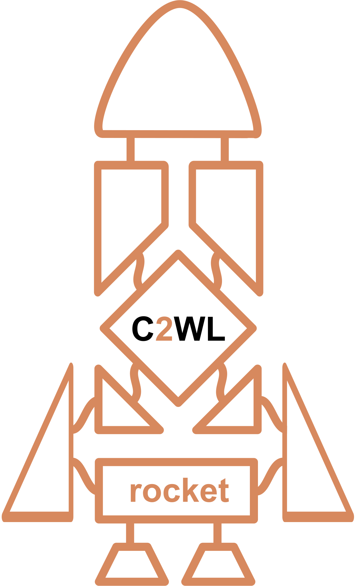

# C2WL-Rocket

<html>
  <table>
    <tr>
      <td>
        
      </td>
      <td>
         A customizable execution engine for the Common Workflow Language (CWL)
         with highly flexible task-level execution, especially useful for cloud applications.
      </td>
    </tr>
  </table>
</html>

## Developmental State:
Please note, C2WL-Rocket is in pre-alpha state.

## Usage:
While a more extensive guide is one the way, please refer to `c2wl-rocket --help`.

## Licence:
This repository is free to use and modify under the Apache 2.0 Licence.
